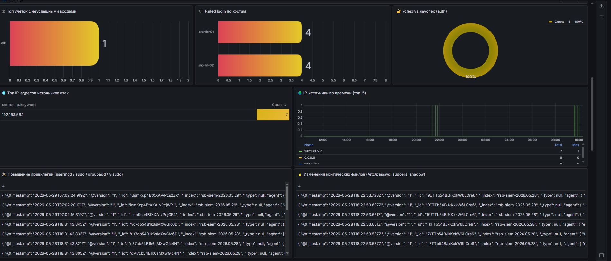
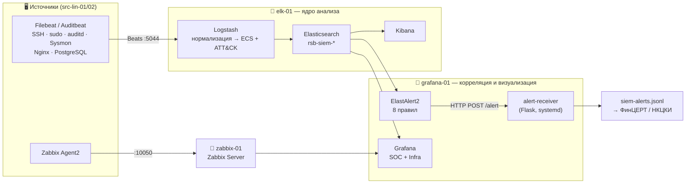
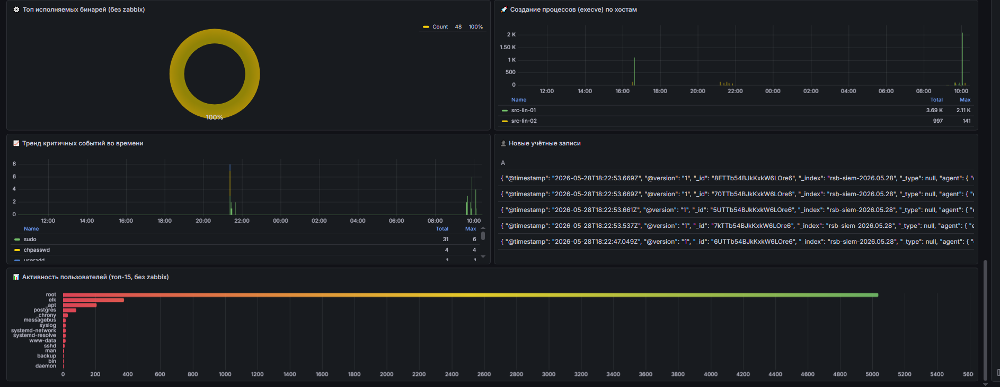
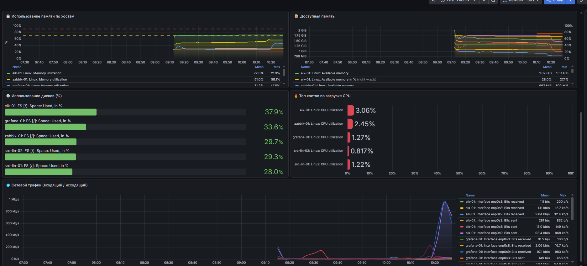
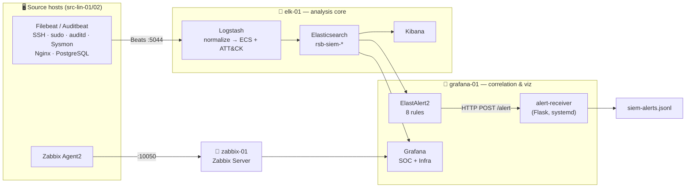

<div align="center">

# 🛡️ Centralized SIEM / SOC Monitoring Lab

### Real-time security event collection · ECS normalization · MITRE ATT&CK correlation · unified dashboards
#### Built end-to-end on open-source — **Elastic Stack · Zabbix · Grafana** — with zero SIEM license cost

<br>



<br><br>


<br>


<br>

**🇷🇺 [Русский](#-русский) · 🇬🇧 [English](#-english)**

</div>

---

## 🇷🇺 Русский

> **Централизованная система мониторинга и анализа событий безопасности (SIEM / SOC) на свободном ПО.**
> Дипломный проект по специальности «Обеспечение информационной безопасности автоматизированных систем».

Система в реальном времени собирает события из разнородных источников, нормализует их к единой схеме, коррелирует по правилам на основе **MITRE ATT&CK**, формирует оповещения об инцидентах и визуализирует состояние защищённости — **без коммерческих SIEM-лицензий и привязки к вендору**. Реализован полный конвейер **сбор → нормализация → корреляция → оповещение → визуализация** на стенде из пяти ВМ, имитирующем сегмент банковской инфраструктуры.

> ⚠️ Лабораторный стенд (proof-of-concept). Пароли, ключи и сертификаты заменены заглушками `********`; IP-адреса — из изолированной тестовой сети.

### ✨ Ключевые особенности

| | |
|---|---|
| 🔎 **Сбор без слепых зон** | Filebeat / Auditbeat собирают SSH, sudo, auditd, Sysmon, Nginx, PostgreSQL |
| 🧩 **Единая схема ECS** | Logstash + grok приводят 168 полей к Elastic Common Schema |
| 🎯 **Детект по ATT&CK** | 8 корреляционных правил ElastAlert2, MTTD ≤ 5 минут |
| 🔔 **Готов к реагированию** | алерты пишутся в `siem-alerts.jsonl` → ФинЦЕРТ / НКЦКИ |
| 📊 **Единое окно SOC** | Grafana объединяет события (ES) и метрики инфраструктуры (Zabbix) |
| 💸 **Экономия ~47 млн ₽ / 5 лет** | открытый стек против коммерческого SIEM при том же покрытии |

### 🧱 Стек и версии

| Компонент | Версия | Роль |
|-----------|--------|------|
| Elasticsearch | `8.13.4` (кластер `rsb-siem`) | хранение и поиск событий |
| Logstash | `8.x` | нормализация, grok, ECS, теги ATT&CK |
| Kibana | `8.x` | расследование и поиск |
| Filebeat / Auditbeat | `8.x` | сбор логов и аудита на источниках |
| ElastAlert2 | — | корреляция и алертинг (8 правил) |
| Zabbix | `6.4.21` + PostgreSQL | мониторинг доступности и метрик |
| Grafana | `11` | единая визуализация (ES + Zabbix) |
| ОС стенда | Ubuntu Server 22.04 LTS | прод-аналог — Astra Linux SE (ФСТЭК) |

<sub>Все компоненты — свободные лицензии (Apache 2.0 / GPL v2 / AGPL v3 / SSPL), без лицензионных платежей.</sub>

### 🗺️ Архитектура



### 🌐 Топология стенда

| Узел | IP (siem-net) | Роль |
|------|---------------|------|
| `elk-01` | `10.10.0.10` | Elasticsearch :9200, Logstash :5044, Kibana :5601 |
| `zabbix-01` | `10.10.0.11` | Zabbix Server + PostgreSQL |
| `grafana-01` | `10.10.0.12` | Grafana, ElastAlert2, приёмник алертов :5001 |
| `src-lin-01` | `10.10.0.20` | Nginx (имитация ДБО), Filebeat, Auditbeat |
| `src-lin-02` | `10.10.0.21` | PostgreSQL 14 (имитация АБС), Filebeat, Auditbeat, Sysmon |

<sub>Сети VirtualBox: **NAT** (интернет) · **Host-Only** `192.168.56.0/24` (управление) · **Internal `siem-net`** `10.10.0.0/24` (изолированный мониторинг).</sub>

### ⚙️ Как это работает

```
① Сбор        Filebeat/Auditbeat → elk-01:5044
② Нормализация Logstash: grok → ECS → теги MITRE ATT&CK
③ Хранение    Elasticsearch, индексы rsb-siem-* (hot/warm/cold + ILM)
④ Корреляция  ElastAlert2 опрашивает ES раз в минуту по 8 правилам
⑤ Реагирование POST /alert → Flask → siem-alerts.jsonl → ФинЦЕРТ/НКЦКИ
⑥ Визуализация Grafana: события (ES) + метрики (Zabbix) на одном экране
```

### 🎯 Правила детектирования (ElastAlert2)

8 правил на основе тактик **MITRE ATT&CK**, по логике совместимых с форматом Sigma:

| # | Правило | Тип | Логика срабатывания | ATT&CK* |
|:-:|---------|-----|--------------------|:-------:|
| 1 | SSH brute-force | `frequency` | ≥ 8 неуспешных входов / 5 мин с одного IP | `T1110` |
| 2 | Sudo auth failures | `frequency` | ≥ 5 ошибок sudo / 5 мин у пользователя | `T1110` |
| 3 | New user account | `any` | создание учётной записи (`useradd`/`adduser`) | `T1136` |
| 4 | Privilege escalation | `any` | `usermod` / `groupadd` / `visudo` | `T1548` |
| 5 | Download-and-execute | `any` | `curl`/`wget` с пайпом в `bash`/`sh`/`python` | `T1105` |
| 6 | Critical file change | `any` | `/etc/passwd`, `/etc/shadow`, `/etc/sudoers` | `T1222` |
| 7 | Large outbound transfer | `metric_aggregation` | аномальный исходящий трафик | `T1048` |
| 8 | Off-hours login | `any` | успешный вход в нерабочее время | `T1078` |

<sub>* Сопоставление с MITRE ATT&CK приведено ориентировочно.</sub>

<details>
<summary>📦 <b>Развёртывание (нажми, чтобы развернуть)</b></summary>

<br>

Порядок повторяет промышленное внедрение: **сеть → хранилище → агенты → корреляция/визуализация → проверка детекта**.

**1. Сеть (VirtualBox)** — 3 адаптера на каждой ВМ: NAT, Host-Only `192.168.56.0/24`, Internal `siem-net` `10.10.0.0/24`.

**2. Ядро анализа (`elk-01`)**
```bash
sudo cp logstash/conf.d/*.conf  /etc/logstash/conf.d/
sudo cp kibana/kibana.yml        /etc/kibana/kibana.yml
sudo systemctl enable --now elasticsearch logstash kibana
```

**3. Источники (`src-lin-01/02`)**
```bash
sudo cp beats/filebeat/filebeat.yml          /etc/filebeat/filebeat.yml
sudo cp beats/filebeat/modules.d/system.yml  /etc/filebeat/modules.d/system.yml
sudo cp beats/auditbeat/auditbeat.yml        /etc/auditbeat/auditbeat.yml
sudo systemctl enable --now filebeat auditbeat
```

**4. Инфраструктурный мониторинг (`zabbix-01`)** — Zabbix 6.4 + PostgreSQL, конфиг `zabbix/zabbix_server.conf`; на узлах — `zabbix/zabbix_agent2.conf`.

**5. Корреляция и визуализация (`grafana-01`)**
```bash
cp elastalert/elastalert-config.yaml /opt/elastalert/config.yaml
cp -r elastalert/rules               /opt/elastalert/rules
python3 elastalert/alert-receiver.py     # systemd-служба, :5001
# импортировать в Grafana:
#   grafana/dashboards/soc-overview.json
#   grafana/dashboards/infrastructure-zabbix.json
```

**6. Проверка детекта** — сгенерировать атаку и убедиться, что алерт появился в `siem-alerts.jsonl` и на дашборде SOC.

> 💡 Подставь реальные пароли/сертификаты вместо `********` и адаптируй IP под свою сеть.

</details>

### 📈 Результаты

Контрольный пример на стенде из 5 узлов. Отыграны два сценария: **подбор пароля по SSH** (правило №1) и **создание скрытой учётной записи `backdoor_user`** (одновременно правила №3 и №4 — закрепление).

| Целевой показатель | Результат |
|--------------------|:---------:|
| Время обнаружения (MTTD) | **≤ 5 минут** ✅ |
| Нормализация к ECS | **168 полей** ✅ |
| Правила корреляции (MITRE ATT&CK) | **8** ✅ |
| Дашборды (SOC + Infrastructure) | **2** ✅ |
| Сквозной путь событие → алерт → дашборд → журнал | подтверждён ✅ |
| Интеграция с реагированием (ФинЦЕРТ/НКЦКИ) | через `siem-alerts.jsonl` ✅ |

> 💸 **Экономика.** Весь стек свободный → лицензий нет. TCO за 5 лет ≈ **30,4 млн ₽** против коммерческого SIEM (MaxPatrol SIEM) — экономия ~**47 млн ₽** за тот же период при сопоставимом покрытии, плюс отсутствие vendor lock-in и соответствие Указу № 250.

### 🚀 Выводы и развитие

Спроектирована и экспериментально подтверждена модульная архитектура SOC на открытом стеке: события нормализуются к единой схеме, коррелируются по ATT&CK, обнаружение укладывается в целевое время, алерты встроены в процесс реагирования. Архитектура линейно масштабируется (источники → агенты Beats, данные → data-узлы ES, филиалы → прокси Zabbix) без замены платформы.
**Дальше:** EDR/DLP/WAF как источники · расширение покрытия ATT&CK · поведенческий анализ и ML · автоматизация реагирования (SOAR).

### 🖼️ Скриншоты

| SOC: источники атак | SOC: критичные события | Инфраструктура (Zabbix) |
|:---:|:---:|:---:|
|  |  |  |

<sub>Полная галерея — в <a href="docs/screenshots/"><code>docs/screenshots/</code></a>.</sub>

### 🗂️ Структура репозитория

```
.
├── logstash/conf.d/        # input → filter (grok, ECS, ATT&CK) → output
├── beats/
│   ├── filebeat/           # filebeat.yml + модуль system
│   └── auditbeat/          # auditbeat.yml
├── kibana/                 # kibana.yml
├── zabbix/                 # zabbix_server.conf, zabbix_agent2.conf
├── elastalert/
│   ├── rules/              # 8 правил детектирования (.yaml)
│   ├── elastalert-config.yaml
│   └── alert-receiver.py   # приёмник алертов (Flask)
├── grafana/dashboards/     # JSON-модели дашбордов SOC и Infra
└── docs/screenshots/       # 19 скриншотов работы стенда
```

---

## 🇬🇧 English

> **A centralized security event monitoring system (SIEM / SOC) built entirely on open-source software.**
> Diploma project in Information Security of Automated Systems.

It collects events from heterogeneous sources in real time, normalizes them to a single schema, correlates them with **MITRE ATT&CK**-based rules, raises incident alerts and visualizes the security posture — **with no commercial SIEM licenses and no vendor lock-in**. The full **collect → normalize → correlate → alert → visualize** pipeline runs on a 5-VM lab simulating a segment of a bank's infrastructure.

> ⚠️ Proof-of-concept lab. Passwords, keys and certificates are redacted as `********`; IPs belong to an isolated test network.

### ✨ Highlights

| | |
|---|---|
| 🔎 **No blind spots** | Filebeat / Auditbeat collect SSH, sudo, auditd, Sysmon, Nginx, PostgreSQL |
| 🧩 **One schema (ECS)** | Logstash + grok normalize 168 fields to Elastic Common Schema |
| 🎯 **ATT&CK detection** | 8 ElastAlert2 correlation rules, MTTD ≤ 5 minutes |
| 🔔 **Response-ready** | alerts written to `siem-alerts.jsonl` for incident handling |
| 📊 **Single SOC pane** | Grafana unifies events (ES) and infra metrics (Zabbix) |
| 💸 **~47M ₽ saved / 5 yrs** | open stack vs a commercial SIEM at comparable coverage |

### 🧱 Stack & versions

| Component | Version | Role |
|-----------|---------|------|
| Elasticsearch | `8.13.4` (cluster `rsb-siem`) | event storage & search |
| Logstash | `8.x` | normalization, grok, ECS, ATT&CK tags |
| Kibana | `8.x` | investigation / search |
| Filebeat / Auditbeat | `8.x` | log & audit collection |
| ElastAlert2 | — | correlation & alerting (8 rules) |
| Zabbix | `6.4.21` + PostgreSQL | infra availability & metrics |
| Grafana | `11` | unified visualization (ES + Zabbix) |
| Lab OS | Ubuntu Server 22.04 LTS | prod analog: Astra Linux SE |

<sub>All components are open-source (Apache 2.0 / GPL v2 / AGPL v3 / SSPL) — no license fees.</sub>

### 🗺️ Architecture



### 🌐 Lab topology

| Node | IP (siem-net) | Role |
|------|---------------|------|
| `elk-01` | `10.10.0.10` | Elasticsearch, Logstash, Kibana |
| `zabbix-01` | `10.10.0.11` | Zabbix Server + PostgreSQL |
| `grafana-01` | `10.10.0.12` | Grafana, ElastAlert2, alert receiver |
| `src-lin-01` | `10.10.0.20` | Nginx (online-banking), Filebeat, Auditbeat |
| `src-lin-02` | `10.10.0.21` | PostgreSQL 14 (core banking), Filebeat, Auditbeat, Sysmon |

<sub>VirtualBox networks: **NAT** (internet) · **Host-Only** `192.168.56.0/24` (mgmt) · **Internal `siem-net`** `10.10.0.0/24` (isolated monitoring).</sub>

### 🎯 Detection rules (ElastAlert2)

| # | Rule | Type | Trigger | ATT&CK* |
|:-:|------|------|---------|:-------:|
| 1 | SSH brute-force | `frequency` | ≥ 8 failed logins / 5 min from one IP | `T1110` |
| 2 | Sudo auth failures | `frequency` | ≥ 5 sudo failures / 5 min per user | `T1110` |
| 3 | New user account | `any` | account creation (`useradd`/`adduser`) | `T1136` |
| 4 | Privilege escalation | `any` | `usermod` / `groupadd` / `visudo` | `T1548` |
| 5 | Download-and-execute | `any` | `curl`/`wget` piped into `bash`/`sh`/`python` | `T1105` |
| 6 | Critical file change | `any` | `/etc/passwd`, `/etc/shadow`, `/etc/sudoers` | `T1222` |
| 7 | Large outbound transfer | `metric_aggregation` | anomalous outbound traffic | `T1048` |
| 8 | Off-hours login | `any` | successful login outside business hours | `T1078` |

<sub>* MITRE ATT&CK mapping is approximate.</sub>

<details>
<summary>📦 <b>Deployment (click to expand)</b></summary>

<br>

Order mirrors a production rollout: **network → storage → agents → correlation/viz → detection test**.

```bash
# elk-01: analysis core
sudo cp logstash/conf.d/*.conf /etc/logstash/conf.d/
sudo cp kibana/kibana.yml      /etc/kibana/kibana.yml

# src-lin-0x: collection agents
sudo cp beats/filebeat/filebeat.yml   /etc/filebeat/filebeat.yml
sudo cp beats/auditbeat/auditbeat.yml /etc/auditbeat/auditbeat.yml

# grafana-01: correlation + receiver + dashboards
cp -r elastalert/rules /opt/elastalert/rules
python3 elastalert/alert-receiver.py     # systemd service, :5001
# import grafana/dashboards/*.json into Grafana
```

> 💡 Replace every `********` placeholder with real credentials and adjust IPs for your network.

</details>

### 📈 Results

Validated on the 5-node lab with two attack scenarios: **SSH brute-force** (rule #1) and **a hidden `backdoor_user` account** (rules #3 and #4 firing together — persistence).

| Target | Result |
|--------|:------:|
| Detection time (MTTD) | **≤ 5 minutes** ✅ |
| ECS normalization | **168 fields** ✅ |
| Correlation rules (MITRE ATT&CK) | **8** ✅ |
| Dashboards (SOC + Infrastructure) | **2** ✅ |
| End-to-end: event → alert → dashboard → log | confirmed ✅ |

> 💸 Open-source stack → no license fees. Estimated 5-year TCO ≈ **30.4M ₽** vs a commercial SIEM (MaxPatrol SIEM) — about **47M ₽** saved over the same period at comparable coverage, with no vendor lock-in.

### 🚀 Conclusion & roadmap

A modular open-source SOC architecture, designed and experimentally validated: events are normalized to one schema, correlated with ATT&CK rules, detected within target time, and alerts feed the response process. It scales linearly (more sources → Beats; more data → ES data nodes; more sites → Zabbix proxies) without changing the platform.
**Next:** EDR/DLP/WAF sources · wider ATT&CK coverage · behavioral analytics / ML · SOAR automation.

### 🗂️ Repository layout

```
logstash/conf.d/   input → filter (grok, ECS, ATT&CK) → output
beats/             Filebeat (+ system module) and Auditbeat configs
kibana/            kibana.yml
zabbix/            server + agent2 configs
elastalert/        8 detection rules, config, Flask alert receiver
grafana/dashboards JSON models for SOC + Infra dashboards
docs/screenshots/  19 lab screenshots
```

---

<div align="center">

Released under the **[MIT License](LICENSE)** · configs are for educational use — review and harden before production.

<sub>⭐ If you find this useful, consider starring the repo.</sub>

</div>
