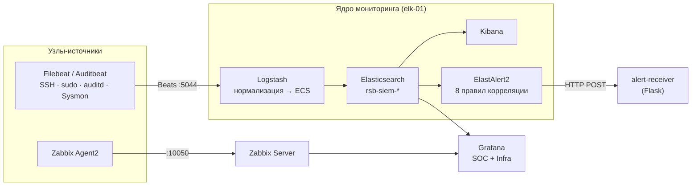
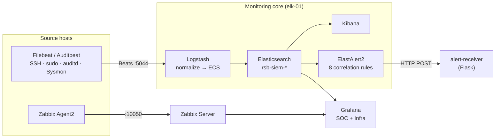

# Centralized SIEM / SOC monitoring lab — Elastic Stack + Zabbix + Grafana

<p align="center">
  
</p>

<p align="center">
  
  
  
  
  
</p>

<p align="center">
  <b>🇷🇺 <a href="#-русский">Русский</a> &nbsp;|&nbsp; 🇬🇧 <a href="#-english">English</a></b>
</p>

---

## 🇷🇺 Русский

Учебно-исследовательский проект построения **централизованной системы мониторинга и анализа событий безопасности** (SIEM / SOC) на свободном программном обеспечении. Выполнен как дипломный проект по специальности «Обеспечение информационной безопасности автоматизированных систем».

Система реализует полный конвейер: **сбор → нормализация → корреляция → оповещение → визуализация** событий безопасности на стенде из нескольких виртуальных машин, имитирующем сегмент инфраструктуры банка.

> ⚠️ Это лабораторный стенд. Все пароли, ключи и сертификаты в конфигурациях заменены заглушками `********`. IP-адреса соответствуют изолированной тестовой сети.

### Что внутри

- **Сбор логов** — `Filebeat` и `Auditbeat` на узлах-источниках (SSH, sudo, auditd, Sysmon for Linux, журналы PostgreSQL и Nginx).
- **Нормализация** — конвейер `Logstash` с grok-разбором и приведением полей к схеме Elastic Common Schema (ECS).
- **Хранение и поиск** — `Elasticsearch` (индексы `rsb-siem-*`), визуализация в `Kibana`.
- **Корреляция и оповещение** — `ElastAlert2`: 8 правил детектирования + собственный приёмник алертов на `Flask`.
- **Мониторинг инфраструктуры** — `Zabbix` (доступность, CPU, память, диск, сеть узлов).
- **Дашборды** — `Grafana`: единое окно SOC и инфраструктурный дашборд.

### Архитектура



### Топология стенда

| Узел | Роль | Сети |
|------|------|------|
| `elk-01` | Elasticsearch :9200, Logstash :5044, Kibana :5601, ElastAlert2 | mgmt `192.168.56.10` · siem-net `10.10.0.10` |
| `zbx-01` | Zabbix Server | siem-net `10.10.0.11` |
| `src-lin-01/02` | Узлы-источники (Nginx, PostgreSQL, агенты) | siem-net |
| Grafana / receiver | Визуализация и приём алертов | siem-net `10.10.0.12` |

Сети VirtualBox: **NAT** (доступ в интернет), **Host-Only** `192.168.56.0/24` (управление), **Internal `siem-net`** `10.10.0.0/24` (изолированный трафик мониторинга).

### Правила детектирования (ElastAlert2)

| # | Правило | Тип | Логика | ATT&CK* |
|---|---------|-----|--------|---------|
| 1 | SSH brute-force | frequency | ≥ 8 неуспешных входов за 5 мин с одного IP | T1110 |
| 2 | Sudo authentication failures | frequency | ≥ 5 ошибок sudo за 5 мин у пользователя | T1110 / T1078 |
| 3 | New user account created | any | создание учётной записи (`useradd`/`adduser`) | T1136 |
| 4 | Privilege escalation | any | `usermod`/`groupadd`/`visudo`, изменение прав | T1548 / T1068 |
| 5 | Suspicious download-and-execute | any | `curl`/`wget` с пайпом в `bash`/`sh`/`python` | T1105 / T1059 |
| 6 | Critical system file modification | any | изменение `/etc/passwd`, `/etc/shadow`, `/etc/sudoers` | T1222 / T1565 |
| 7 | Large outbound data transfer | metric_aggregation | аномальный исходящий трафик | T1048 |
| 8 | Off-hours successful login | any | успешный вход в нерабочее время | T1078 |

<sub>* Сопоставление с MITRE ATT&CK приведено ориентировочно.</sub>

### Структура репозитория

```
.
├── logstash/conf.d/        # input → filter (grok, ECS) → output
├── beats/
│   ├── filebeat/           # filebeat.yml + модуль system
│   └── auditbeat/          # auditbeat.yml
├── kibana/                 # kibana.yml
├── zabbix/                 # zabbix_server.conf, zabbix_agent2.conf
├── elastalert/
│   ├── rules/              # 8 правил детектирования (.yaml)
│   ├── elastalert-config.yaml
│   └── alert-receiver.py   # приёмник алертов (Flask)
├── grafana/dashboards/     # JSON-модели дашбордов SOC и Infra
└── docs/screenshots/       # скриншоты работы стенда
```

### Скриншоты

| SOC: источники атак | SOC: критичные события | Инфраструктура (Zabbix) |
|---|---|---|
|  |  |  |

Полная галерея — в [`docs/screenshots/`](docs/screenshots/).

### Технологии

`Elasticsearch` · `Logstash` · `Kibana` · `Filebeat` · `Auditbeat` · `ElastAlert2` · `Zabbix` · `Grafana` · `Python (Flask)` · `Sysmon for Linux` · `auditd` · ECS · MITRE ATT&CK

---

## 🇬🇧 English

An academic / lab project that builds a **centralized security event monitoring system** (SIEM / SOC) entirely on open-source software. Developed as a diploma project in Information Security of Automated Systems.

It implements the full pipeline — **collect → normalize → correlate → alert → visualize** — on a multi-VM lab that simulates a segment of a bank's infrastructure.

> ⚠️ This is a lab environment. All passwords, keys and certificates in the configs are redacted as `********`. IP addresses belong to an isolated test network.

### Highlights

- **Log collection** — `Filebeat` and `Auditbeat` on source hosts (SSH, sudo, auditd, Sysmon for Linux, PostgreSQL and Nginx logs).
- **Normalization** — a `Logstash` pipeline with grok parsing, mapping fields to the Elastic Common Schema (ECS).
- **Storage & search** — `Elasticsearch` (`rsb-siem-*` indices) with `Kibana`.
- **Correlation & alerting** — `ElastAlert2`: 8 detection rules + a custom `Flask` alert receiver.
- **Infrastructure monitoring** — `Zabbix` (host availability, CPU, memory, disk, network).
- **Dashboards** — `Grafana`: a single-pane SOC overview and an infrastructure dashboard.

### Architecture



### Detection rules (ElastAlert2)

| # | Rule | Type | Logic | ATT&CK* |
|---|------|------|-------|---------|
| 1 | SSH brute-force | frequency | ≥ 8 failed logins in 5 min from one IP | T1110 |
| 2 | Sudo authentication failures | frequency | ≥ 5 sudo failures in 5 min per user | T1110 / T1078 |
| 3 | New user account created | any | account creation (`useradd`/`adduser`) | T1136 |
| 4 | Privilege escalation | any | `usermod`/`groupadd`/`visudo`, permission change | T1548 / T1068 |
| 5 | Suspicious download-and-execute | any | `curl`/`wget` piped into `bash`/`sh`/`python` | T1105 / T1059 |
| 6 | Critical system file modification | any | changes to `/etc/passwd`, `/etc/shadow`, `/etc/sudoers` | T1222 / T1565 |
| 7 | Large outbound data transfer | metric_aggregation | anomalous outbound traffic | T1048 |
| 8 | Off-hours successful login | any | successful login outside business hours | T1078 |

<sub>* MITRE ATT&CK mapping is approximate.</sub>

### Repository layout

```
logstash/conf.d/   input → filter (grok, ECS) → output
beats/             Filebeat (+ system module) and Auditbeat configs
kibana/            kibana.yml
zabbix/            server + agent2 configs
elastalert/        8 detection rules, config, Flask alert receiver
grafana/dashboards JSON models for SOC + Infra dashboards
docs/screenshots/  lab screenshots
```

### Tech stack

`Elasticsearch` · `Logstash` · `Kibana` · `Filebeat` · `Auditbeat` · `ElastAlert2` · `Zabbix` · `Grafana` · `Python (Flask)` · `Sysmon for Linux` · `auditd` · ECS · MITRE ATT&CK

---

## License

Released under the [MIT License](LICENSE). Configuration files are provided for educational purposes; review and harden them before any production use.
